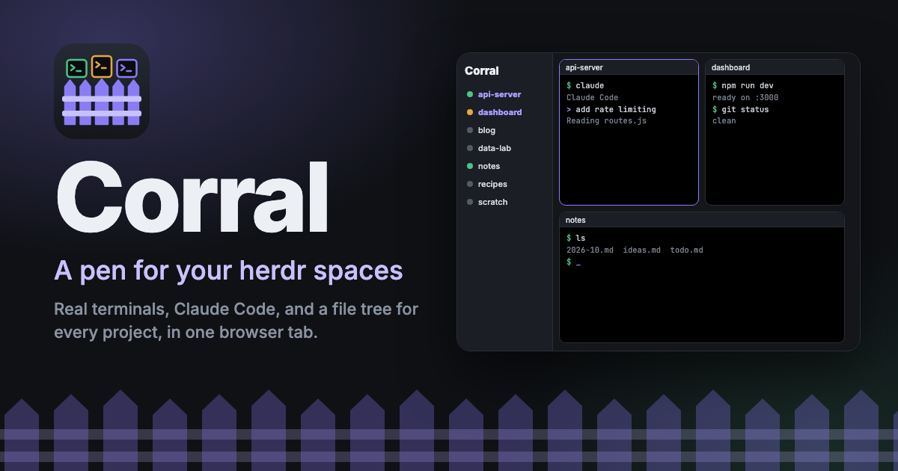
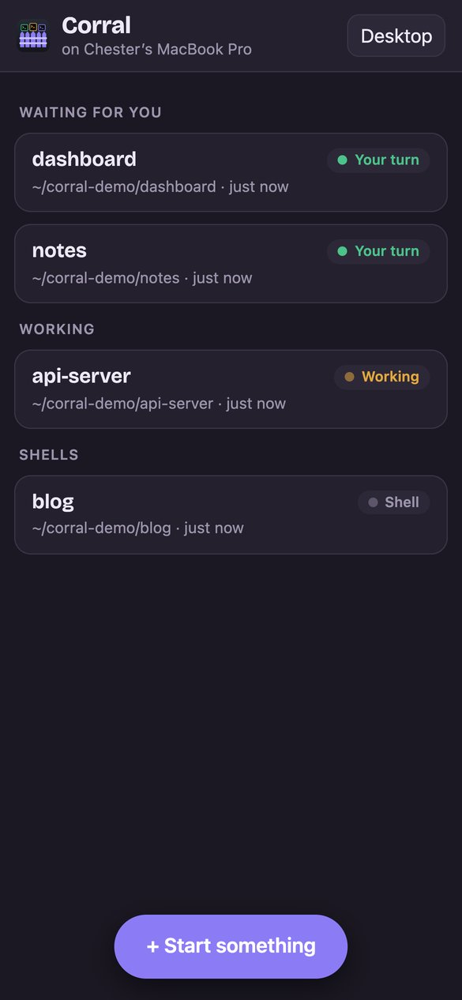
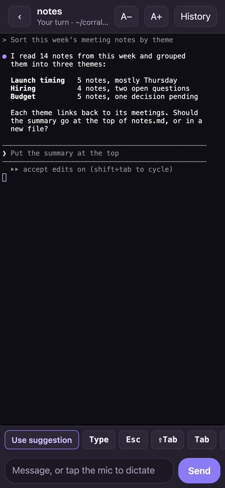
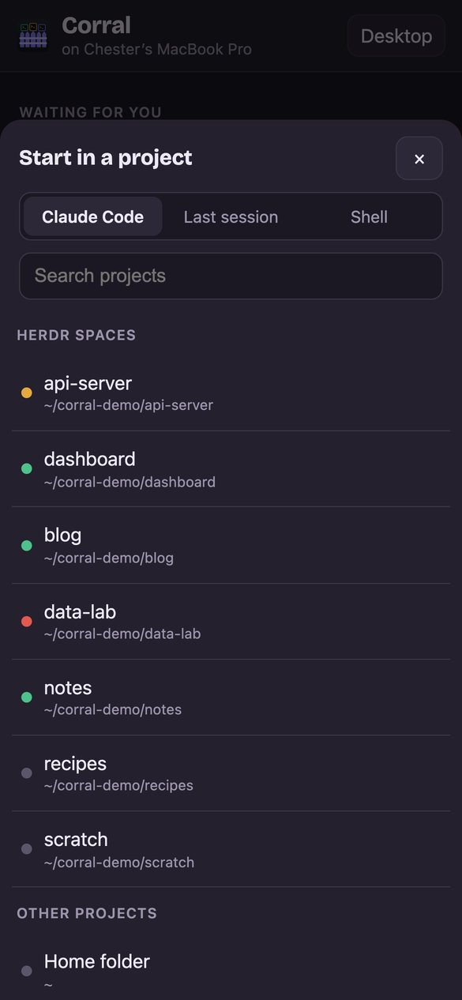
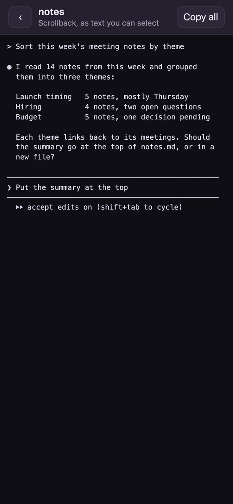

<p align="center">
  
</p>

# Corral

A pen for your [herdr](https://github.com/herdrdev/herdr) spaces. Corral is a
small local web app that runs beside herdr and gives every space a real
terminal in your browser: click a project and Claude Code (or a plain shell)
opens in its folder, arranged in the layout you pick.

It does not replace herdr. herdr keeps managing your spaces and agents; Corral
reads herdr's list of spaces and opens its own terminals for them.

Project site, with screenshots and use cases: <https://ismayc.github.io/corral/>

## What you get

- **Every herdr space in a sidebar**, with herdr's agent status (working,
  idle, blocked) as a colored dot, and a search box.
- **Click a space to start work there.** By default that starts Claude Code in
  the project folder; you can switch to "Claude Code, last session"
  (`claude --continue`) or a plain shell. The shell stays open after Claude
  exits.
- **Layouts for your windows**, in the spirit of
  [Sash](https://github.com/ismayc/sash): Auto (picks a tiling from how many
  windows are open and the shape of the screen), Halves, Thirds, Quarters,
  Main + 2, 2 over 1, 3 x 3, and more, plus a plain columns-by-rows grid. Drag a
  window's title bar onto another zone to move it there or swap.
- **Minimize** a window to the bottom bar; it keeps running, and one click
  brings it back.
- **Terminals that survive.** Each shell lives in its own tmux session, so
  closing the tab, reloading, or restarting Corral leaves your work running.
  Every running terminal gets a window when the page loads, even in a new
  browser or after the browser's storage is cleared.
- **Restore after a restart.** Corral keeps a backup of the open windows,
  including the Claude Code conversation in each. If the windows are gone
  (after a Mac restart, say), a **Restore** button reopens them, each in its
  folder and resuming its conversation with `claude --resume`. The page never
  sends the IDs: the server reads them from its own backup, and resumes only a
  well-formed ID that Claude Code has on disk.
- **A resizable bottom bar.** Minimized windows wait in the bar at the
  bottom. Drag its top edge to make it bigger or smaller; double-click the
  edge to reset it.
- **Your windows on your phone**, through [Tailscale](https://tailscale.com)
  (setup and screenshots below, in
  [Remote control from your phone](#remote-control-from-your-phone-with-tailscale)).
  Open `/m` from any device signed in to your tailnet to see every window on
  the Mac, sorted by whose turn it is (Claude waiting for you, Claude working,
  plain shells), with each one's folder and when it last printed. Tap one for
  a full terminal with the keys a phone lacks (Esc, Shift-Tab, Ctrl, arrows,
  and the numbers for Claude Code's menus), a **Use suggestion** key that
  sends Claude Code's suggested next prompt (Tab, then Enter), a message box
  that works with dictation, and a History view of the scrollback as text you
  can select. You can also start
  Claude Code in any project (it also appears, minimized, in the bottom bar of
  the Mac's Corral page), or restore windows after a restart. Add it to
  your Home Screen and it opens like an app. Another computer on your tailnet
  gets the full desktop page.
- **Categories** you define, with collapsible groups. To move a space,
  right-click it (or use its ⋯ button) and pick a group, or drag it onto any
  group's header or rows. Cmd-click or Shift-click to select several spaces
  and move them together, or search and move every match at once. Each move
  can be undone from the notice that follows it.
- **A file tree for each space**, limited to that project's folder. Click a
  file to open it in a Mac app. Until you set a default for that type of file,
  Corral asks which app, from the list macOS itself offers (the same as
  Finder's Open With), with the macOS default marked. Tick "Always open .md
  files this way" to skip the question next time; right-click a file to pick
  another app or forget the default. Files of a type macOS does not know get
  the apps that open plain text.
- **Inactive projects.** Corral remembers every project folder it has seen. If
  a herdr space disappears (for example, closing a space's only pane closes
  the space), the project shows under "Inactive projects" with a Reopen button.

## Requirements

- macOS. That is where Corral is built and tested; Linux may work but is
  untested.
- [Node.js](https://nodejs.org/) (tested with Node 24).
- [herdr](https://github.com/herdrdev/herdr) on your `PATH` or at
  `~/.local/bin/herdr` (tested with herdr 0.9.3).
- [tmux](https://github.com/tmux/tmux) (recommended; `brew install tmux`).
  Without it, Corral still works, but shells end when the server stops.
- [Claude Code](https://github.com/anthropics/claude-code) if you want a
  click to start it.

## Run it

```sh
git clone https://github.com/ismayc/corral.git
cd corral
npm install      # also makes node-pty's helper executable
npm start        # then open http://127.0.0.1:8777
```

Settings, all optional, by environment variable:

| Variable | Default | What it does |
|---|---|---|
| `CORRAL_PORT` | `8777` | Port to listen on (always on 127.0.0.1) |
| `CORRAL_TMUX_SOCKET` | `corral` | Name of Corral's private tmux server |
| `HERDR_BIN` | `~/.local/bin/herdr`, else `herdr` on your `PATH` | Path to the herdr command |
| `CORRAL_SORT_BIN` | `scripts/herdr-sort-spaces` | Script that re-sorts herdr spaces after a Reopen |
| `CORRAL_TAILSCALE` | on | Set to `0` to refuse every request through Tailscale |
| `CORRAL_TAILSCALE_PORT` | `8443` | The HTTPS port `tailscale serve` uses for Corral |
| `CORRAL_TAILSCALE_USERS` | the login that owns this Mac in Tailscale | Comma-separated Tailscale logins allowed in |

To use Corral from your phone or another computer, see the next section.

## Remote control from your phone, with Tailscale

<p align="center">
  
  
  
  
</p>
<p align="center"><sub>The phone page with made-up projects: the list of windows, a Claude Code window, starting something new, and History.</sub></p>

Corral works as a remote control for every terminal on your Mac. From your
phone (or a tablet, or another computer), you can see which Claude Code
sessions are waiting for you, answer them, start new ones, and read back
what happened, all over [Tailscale](https://tailscale.com), the private
network between your own devices.

### What you can do from the phone

- **See whose turn it is.** Every window on the Mac is listed, Claude Code
  sessions waiting for you first, then the ones still working, then plain
  shells, each with its folder and when it last printed. When a session finishes
  while the page is open, a notice says so.
- **Answer in a real terminal.** Tap a window to open it. A row of keys covers
  what a phone keyboard lacks: **Use suggestion** (sends Claude Code's dimmed
  suggested prompt in one tap), Esc, Shift-Tab (Claude Code's modes), Tab,
  Ctrl, ^C, the arrows, Enter, and 1, 2, and 3 for Claude Code's menus.
- **Type or dictate.** The message box at the bottom works with the
  keyboard's microphone. A message with several lines goes in as one.
- **Start something new.** Pick Claude Code, its last session, or a shell, then
  a herdr space or another project. The new window also shows up, minimized,
  in the bottom bar of Corral on the Mac, so it is there when you sit down. A
  space that already has a window is marked **Open**, and tapping it says so
  instead of starting a second one.
- **Read back.** History shows the window's scrollback as plain text you can
  select, or copy in one tap.
- **Restore** the windows from before a Mac restart.

How it compares with Claude Code's Remote Control (`/rc`): Remote Control
needs no setup beyond signing in, and reaches the Claude Code sessions you
turned it on for, through Anthropic's servers. Corral needs Tailscale on both
devices, and then shows every window on the Mac without turning anything on
(Claude Code and plain shells alike), lets you start new ones in any project,
and reaches your Mac over your tailnet, encrypted end to end.

### Set it up

1. **Install Tailscale** on the Mac and on your phone from
   <https://tailscale.com/download>, and sign in to the same account on both.
2. **Turn on HTTPS for your tailnet.** In the Tailscale admin console, open
   the **DNS** page, make sure **MagicDNS** is on, and under **HTTPS
   Certificates** choose **Enable HTTPS**. Tailscale's certificates are
   recorded in a public log that includes the machine's name, so rename the
   Mac in Tailscale first if its name says anything private.
3. **Have Tailscale forward to Corral.** With Corral running, run this once
   on the Mac:

   ```sh
   npm run tailscale   # tailscale serve --bg --https=8443 http://127.0.0.1:8777
   ```

   If HTTPS is not on yet, the command prints a link to turn it on. The
   setting survives restarts. Port 8443 leaves 443 free for anything else you
   serve.
4. **Open it on the phone.** On the Mac, Corral's **On your phone** button
   copies the address, which looks like
   `https://<this Mac>.<your tailnet>.ts.net:8443/m`. Send it to your phone and
   open it. (Corral's log also prints it, on the line that starts with
   `tailnet access:`.)
5. **Keep it on your Home Screen.** In Safari, use the Share button and
   choose **Add to Home Screen**. Corral then opens full screen, like an app.

Another computer on your tailnet can open the same address without the `/m`
to get the full desktop page. A phone that opens `/` is sent to `/m`, and
`/?desktop` keeps the desktop page.

### Who can get in

Only you. Corral itself still listens on `127.0.0.1` only; Tailscale delivers
requests from your devices to that address. A request through Tailscale must
name this Mac's tailnet address and carry an allowed Tailscale login, which
Tailscale adds to each request and which a device cannot fake. By default the
only allowed login is the one that owns the Mac in Tailscale; set
`CORRAL_TAILSCALE_USERS` to change that. A public Tailscale Funnel request
carries no login, so it gets nothing.

### Turn it off

```sh
tailscale serve --https=8443 off
```

Or start Corral with `CORRAL_TAILSCALE=0`, which refuses every request that
comes through Tailscale.

## Security

A browser terminal is remote code execution by design, so Corral is strict
about who can reach it:

- It listens on `127.0.0.1` only and has **no login of its own**. Do not
  expose it on another interface or behind any other proxy.
- Through Tailscale, a request must name this Mac's tailnet address and carry
  an allowed Tailscale login. `tailscale serve` adds that login to every
  request it forwards and replaces any value the sender supplied; a Funnel
  (public internet) request has none, so turning on Funnel for this port lets
  no one in. By default only the login that owns this Mac is allowed. Each
  change and terminal connection must also come from that same address as its
  `Origin`.
- Every request must carry a loopback `Host` header, which blocks DNS
  rebinding. Every change and every terminal connection must also come from a
  loopback `Origin`, so other websites you visit cannot drive it.
- The browser can only choose from a fixed list of things to start (Claude
  Code, Claude Code with `--continue`, or a shell). It never sends a command.
- The file tree lists names only, never file contents, and refuses any path
  whose real location (after resolving symlinks) is outside the project.
- Opening a file hands it to macOS `open`, either to show it in Finder or with
  an app that macOS lists for that file, checked again on every open. The
  page cannot name any other program.
- If you start Corral from inside a Claude Code session or a herdr pane, it
  removes that session's environment variables (`CLAUDE_CODE_*`, `CLAUDECODE`,
  `HERDR_*`, `TMUX*`) from every shell it starts, so they do not inherit
  another session's identity or tokens.

## What Corral stores

- `~/.local/share/corral/projects.json`: the project folders it has seen and
  when (owner-only permissions).
- `~/.local/share/corral/categories.json`: your categories and which project is
  in each (owner-only permissions).
- `~/.local/share/corral/open-with.json`: the app you chose for each type of
  file (owner-only permissions).
- `~/.local/share/corral/open-sessions.json`: the open windows, rewritten when
  one opens or closes and every 30 seconds. Each entry has the window's name,
  folder, and, when Claude Code is running in it, the conversation ID and a
  `cd ... && claude --resume ...` command you can run by hand (owner-only
  permissions).
- `~/.local/share/corral/restore.json`: written at startup when windows in that
  backup are no longer running; the Restore button reads it and then deletes
  it.
- Your browser's local storage: window layout, which windows are open or
  minimized, and display preferences.
- A private tmux server named `corral`, separate from your own tmux and
  `~/.tmux.conf`. You can attach to a Corral shell from any terminal with
  `tmux -L corral attach -t wt-<id>`.

Nothing is sent anywhere, except to your own devices when you turn on
Tailscale access. The page loads no outside resources; the font is bundled.

## How it works

`server.js` is a single Node process. It serves the page, runs each shell in a
PTY ([node-pty](https://github.com/microsoft/node-pty)) attached to a tmux
session, and streams it to [xterm.js](https://xtermjs.org/) over a WebSocket
([ws](https://github.com/websockets/ws)). It reads the space list from
`herdr api snapshot` and each space's project folder from herdr's
`~/.config/herdr/session.json`, and polls herdr every 30 seconds so it notices
a space that closes while no page is open. herdr's session files are not a
public API, so a future herdr release could change them.

## Limits

- Corral's terminals are its own. herdr's API offers snapshots and events but
  no live byte stream, so Corral cannot show or type into the terminals inside
  herdr itself.
- A window open on the Mac and a phone at once takes the size of whichever
  one typed last (tmux's `window-size latest`), so the other shows it smaller
  or larger until you type there.
- The phone page shows a toast when a Claude Code window turns to "your turn"
  while the page is open; it does not send push notifications.
- After a Corral restart, a window shows the current screen; older scrollback
  stays in tmux (`tmux -L corral attach`) rather than in the browser.
- Reopen re-sorts herdr's spaces alphabetically with
  `scripts/herdr-sort-spaces`, which uses an undocumented herdr method
  (`workspace.move_block`).

## Icons and link preview

The icon is `assets/icon.svg`; the link-preview image is
`assets/og-image.html` rendered to `assets/og-image.png` (1200 x 630).
`scripts/render-assets.sh` re-renders both, plus `public/favicon-32.png` and
`public/apple-touch-icon.png`, with headless Google Chrome and macOS `sips`.

The project site is `docs/index.html`, served by GitHub Pages from the `docs/`
folder on `main`. `render-assets.sh` copies the icons and preview image into
`docs/`. The screenshots in `docs/img/` come from Corral itself, run against a
demo herdr snapshot with made-up projects.

## Credits and licenses

Corral is released under the [MIT License](LICENSE).

It depends on, but does not include, these packages (all MIT): xterm.js and
its fit and web-links add-ons, node-pty (and node-addon-api), and ws. `npm
install` fetches them.

The page bundles the [Bricolage Grotesque](https://github.com/ateliertriay/bricolage)
typeface under the SIL Open Font License 1.1 (`public/fonts/OFL.txt`). The
link-preview image also uses Inter and JetBrains Mono, both under the SIL Open
Font License 1.1.

Corral is an independent project. It is not affiliated with or endorsed by the
herdr project, Anthropic (makers of Claude Code), or tmux. herdr is licensed
under Apache 2.0; Corral uses only its command-line interface and includes none
of its code.
